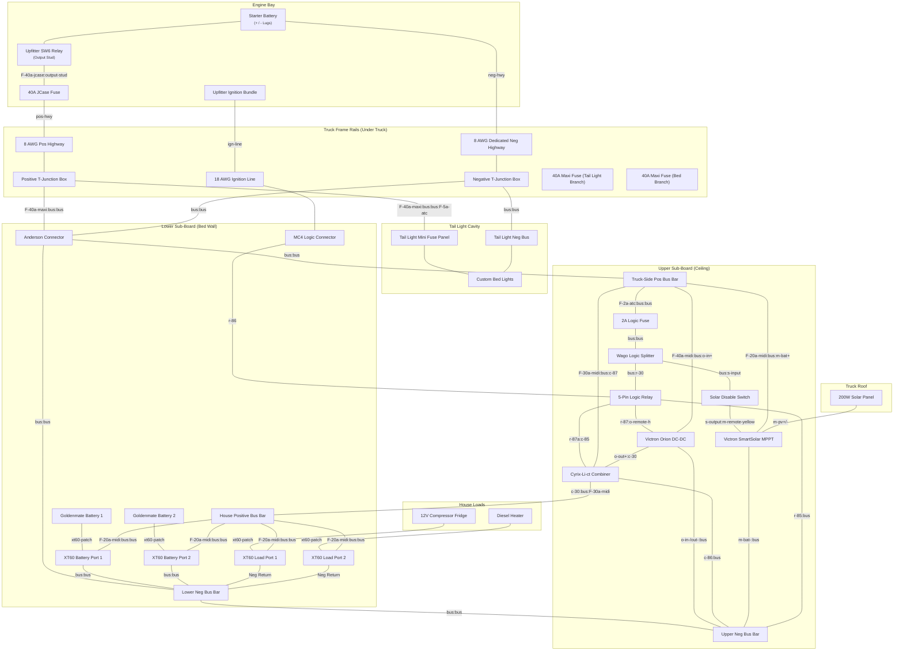

# Mobile Electrical & Solar Micro-Grid: Master Design & Verification Spec
**System Owner:** Christopher Johnson  
**Platform:** 2024 Ford F250 Lariat Tremor (7.3L Gas, SmartCap Bed Camper Shell)  
**Target File Path:** `file:///Users/cjohnson/src/gemini/project-solar-truck/master_design_spec.md`

---

## 1. System Overview & Parasitic Drain Analysis

This system is a dual-battery, solar-assisted 12V DC micro-grid spanning the engine bay, the truck frame rails (for routing only), and the truck bed. It utilizes a **dedicated negative return highway** directly to the starter battery to ensure complete electrical isolation from the truck's chassis.

### ⚠️ Parasitic Drain & Solar Offset Strategy
In the current setup, the main 8 AWG CCA power highway to the tailgate T-junction is powered from the output of **Upfitter Switch 6 (SW6)**, which is configured in the engine compartment to be "hot-at-all-times" (always hot).
* **The Draw (Upfitter Relay Coil):** Leaving the cab's SW6 switch toggled ON keeps the factory upfitter relay coil energized continuously. This relay coil draws **$\sim150\text{–}200\text{mA}$** of holding current.
* **The Strategy (Solar Offset):** Rather than toggling SW6 off, the design strategy is to **leave SW6 toggled ON 24/7** so that the tailgate bus bar and custom bed lights are always active. The continuous draw of the upfitter relay coil ($\sim150\text{–}200\text{mA}$), the Cyrix combiner solenoid when bridged ($\sim220\text{–}300\text{mA}$), and the F250's factory idle draw are intended to be fully offset by the daily energy harvest of the 200W solar panel (which prioritizes keeping the starter battery topped up).
* **Custom vs. OEM Lights:** The custom SmartCap LED light strips (referred to as **truck bed lights**) run off the tailgate fuse panel. These custom lights are controlled by a local switch with an always-on LED, which is distinct from the F250's OEM factory bed lights that feature an automatic timeout. Both systems draw power from the truck's single starter battery.

---

## 2. Core Hardware Inventory & Specifications

### Power Sources & Buffers:
* **House Bank (Removable):** 2x Goldenmate 100Ah Lithium Iron Phosphate (LiFePO4) batteries (sit on the truck bed floor).
  * *Internal Protection:* Integrated BMS with Low-Voltage Disconnect (LVD) threshold $\le 11.0\text{V}$.
  * *Local Fusing:* Each battery box connects via a **12 AWG 24-inch XT60-to-XT60 cable** to the lower sub-board.
  * *Panel Fusing:* Each house battery XT60 port is individually fused at **30A** on the house positive bus bar.
* **Starter Bank:** 2024 Ford F250 OEM single lead-acid starting battery.
* **Solar Array:** 1x Renogy 200W Shadowflux High-Efficiency N-Type Panel.
  * *Max Voltage ($V_{mp}$):* $31.3\text{V}$
  * *Open-Circuit Max Voltage ($V_{oc}$):* $36.5\text{V}$
  * *Max Current ($I_{sc}$):* $\sim7\text{A}$

### Management & Control Electronics:
* **DC-DC Charger:** Victron Orion-Tr Smart 12/12-18A (18A continuous output).
* **Battery Combiner:** Cyrix-Li-ct Intelligent Voltage-Sensing Combiner (bridges at $\ge 13.4\text{V}$, opens at $< 12.8\text{V}$).
* **Solar Charge Controller:** Victron SmartSolar MPPT (Mounted on the upper sub-board, wired to the **truck-side** positive bus bar).
* **Logic Controller:** 5-Pin SPDT Automotive Relay (12V, 30/40A rated).

---
## 3. Physical Layout & Wiring Topology

To support easy removal of the SmartCap, the system is divided into three distinct zones connected by quick-disconnects.

```
                                [ ENGINE BAY (SW6 Relay Box) ] 
                                             │
                                   (40A SW6 JCase Fuse)
                                             │
                             [ 8 AWG CCA Frame Run (Under Truck) ]
                                             │
                          [ FRAME T-JUNCTION BOX (POS & NEG) ]
                      ┌──────────────────────┴──────────────────────┐
                 (40A Maxi Fuse)                               (40A Maxi Fuse)
                      ▼                                             ▼
        [ Tail Light Mini Fuse Panel ]                  [ Anderson Connector (8 AWG OFC) ]
          (SmartCap LED Light Strips)                   [ MC4 Connector (18 AWG Ignition) ]
                                                                    │
                                                           [ LOWER SUB-BOARD ]
```

### 🗺️ System Topology Diagram



> [!NOTE]
> **Implementation Notes:**
> * **Isolated Grounding:** The 8 AWG Dedicated Neg Highway runs directly from the Starter Battery to the Lower Neg Bus Bar, bypassing the vehicle chassis.
> * **Fusing Logic:** House battery XT60 ports are fused at 20A (Conservative) with 30A spares available for high-inrush scenarios.
> * **Interlocking Relay:** The 5-Pin relay alternates between the Cyrix (Solar/Stationary) and Orion (Alternator/Driving) based on the Upfitter Ignition signal.

```
                                                          (Wall above tub lip)
                                                                    │
                                                 ┌──────────────────┴──────────────────┐
                                                 ▼                                     ▼
                                       (8 AWG OFC + 18 AWG Run)              (House Positive Bus Bar)
                                       (Runs up the SmartCap wall)             │─ 30A Fuse -> XT60 Port 1 (Battery 1)
                                                 │                             │─ 30A Fuse -> XT60 Port 2 (Battery 2)
                                                 ▼                             │─ 20A Fuse -> XT60 Load 1 (Fridge/Heat)
                                        [ UPPER SUB-BOARD ]                    │─ 20A Fuse -> XT60 Load 2 (Chargers)
                                      (SmartCap Ceiling/Wall)                  └─ House Battery Negatives
                                                 │
                             ┌───────────────────┼───────────────────┐
                             ▼                   ▼                   ▼
                     [ Truck Bus Bar ]   [ 5-Pin Relay ]    [ Upper Negative Bus Bar ]
```

### 🎛️ Sub-Board Details:

#### 1. Lower Sub-Board (Wall above tub lip):
* **Grounding:** The lower common negative bus bar connects directly to the incoming 8 AWG dedicated negative return wire from the Anderson connector. The 8 AWG negative wire leading to the upper board lands on this same terminal (daisy-chained).
* **Distribution:** Houses the XT60 ports for the house batteries (each fused at **30A**) and load ports (each fused at **20A**).
* **Charging Path:** The final positive terminal on the house-side bus bar (Stud 1) connects to the **8 AWG OFC House Charging Highway** wire running up to the upper sub-board.

#### 2. Upper Sub-Board (SmartCap Ceiling):
* **Truck-Side Positive Bus Bar:** Connects to the incoming always-hot 8 AWG OFC positive line from the Anderson connector.
* **Solar Controller (MPPT) Connections:**
  * Battery (+) runs via a **12 AWG wire** to the truck-side positive bus bar (protected by a **20A MIDI fuse**).
  * Battery (-) runs via a **12 AWG wire** to the upper common negative bus bar.
  * *Logic:* Solar power flows through the truck bus bar and the Anderson/T-junction back to charge the F250's starter batteries first.
* **Combiner (Cyrix) Starter-Side Connection:**
  * Terminal 87 connects to the truck-side positive bus bar via an **8 AWG CCA wire** (protected by a **30A MIDI fuse**).
* **DC-DC Charger (Orion) Input Connection:**
  * Input (+) connects to the truck-side positive bus bar via an **8 AWG CCA wire** (protected by a **40A MIDI fuse**).
  * Input (-) and Output (-) are wired to the upper negative bus bar using **8 AWG CCA**.
* **House Highway Conjunction (Cyrix Terminal 30 / Orion Output+):**
  * The **8 AWG OFC House Charging Highway** wire coming up from the lower board lands directly on **Cyrix Terminal 30**.
  * The Orion Output (+) (8 AWG) lands on this same **Cyrix Terminal 30** lug via a local copper jumper.
  * *Logic:* Power flowing from either the Orion (engine running) or the Cyrix (solar active & starter battery $> 13.4\text{V}$) feeds directly into Cyrix Terminal 30 and travels down the 8 AWG OFC wire to the house positive bus bar.

---

## 4. Control Logic & Switch Configurations

### 🔌 Low-Current Logic Power (2A Blade Fuse & Wago)
To supply logic and remote control power safely:
* A **2A inline blade fuse** taps off the truck-side positive bus bar and feeds a **Wago connector**.
* The Wago connector splits this 12V feed to:
  1. **Pin 30 (SPDT Relay Input):** Provides control voltage to the interlocking relay loop.
  2. **Solar On/Off Switch:** An inline switch that controls the VE.Direct yellow remote enable wire plugged into the MPPT. Flipping this switch OFF immediately drops MPPT generation to 0A, allowing you to isolate the bed grid for battery box maintenance or storage.

### 🎛️ Relay Pinout & Wiring Schedule (SPDT Relay)
The logic wires utilize a mix of **18 AWG and 12 AWG OFC primary wire** matching the component terminals.

* **Pin 30 (Common Input Power):** Red wire from the Wago connector (fused at 2A).
* **Pin 86 (Relay Coil Positive +):** 18 AWG Orange wire coming up from the lower board's MC4 connector, tapped from the **factory Ford upfitter ignition signal bundle** in the engine bay (hot only when key is in ON/RUN position, independent of SW6 state).
* **Pin 85 (Relay Coil Ground -):** Black wire leading directly to the **Upper Common Negative Bus Bar** (Pin 85).
* **Pin 87a (Normally Closed - NC Output):** Green/Orange wire leading directly to **Terminal 85 (Control)** on the **Cyrix-Li-ct Combiner**.
* **Pin 87 (Normally Open - NO Output):** Purple/White wire leading to the green **Remote H-Pin Terminal Block** on the **Victron Orion DC-DC Charger**.

### 🔄 Operational Truth Table

> [!NOTE]
> SW6 (always hot) and the ignition key signal are **independent inputs**. SW6 controls the main 8 AWG power highway to the T-junction and is always energized. The relay coil at Pin 86 is triggered solely by the factory upfitter ignition bundle — it is hot only when the key is in the ON/RUN position, regardless of SW6 state.

| Ignition Key State | Relay Coil (Pin 86) | Relay Pin 30 Connects To | Cyrix Combiner State | Orion DC-DC State | System Behavior |
| :--- | :--- | :--- | :--- | :--- | :--- |
| **Key OFF** | De-energized | **Pin 87a (NC)** | **Armed / Active** | **Forced OFF** | SW6 highway always hot. Solar charges starter battery. When starter hits $>13.4\text{V}$, Cyrix bridges to charge/maintain house bank and run fridge. Auto-disconnects if combined voltage drops below $12.8\text{V}$ (e.g. at night under load). |
| **Key ON/RUN** | Energized | **Pin 87 (NO)** | **Forced OPEN** | **Armed / Active** | Alternator charges starter via SW6 highway. Orion charges house bank at 18A. Cyrix is locked open to prevent alternator overload or uncontrolled bypass loops. |

---

## 5. Main House Panel Power Distribution & Fusing

The lower sub-board house positive bus bar distributes charging current and handles load fusing:

```
                          [ HOUSE POSITIVE BUS BAR ]
      _______________________/_______|_____________________________________
     |               |               |               |               |
 [ STUD 1 ]      [ STUD 2 ]      [ STUD 3 ]      [ STUD 4 ]      [ STUD 5 ]
   (Input)         (20A)           (20A)           (20A)           (20A)
     |               |               |               |               |
  Incoming       XT60 House      XT60 House       XT60 Load       XT60 Load
Charging Hwy     Battery 1       Battery 2        Port 1          Port 2
```

### 🎛️ Board Configuration
* **Stud 1: House Charging Highway (MIDI / 30A - at this stud)**
  * *Wiring:* 8 AWG OFC positive wire running down from Cyrix Terminal 30 on the upper board. The 30A MIDI fuse is placed here at the lower bus bar entry point, protecting the full wire run from fault current flowing up from the house batteries. Upper-board sources (Orion, Cyrix starter-side) are independently current-limited by their own fuses.
* **Stud 2: XT60 House Battery 1 (20A Fuse)**
  * *Wiring:* 12 AWG pure copper pigtail to XT60 port. Connected to battery box via a 24" 12 AWG XT60-to-XT60 patch cable.
  * *Protection Chain:* 20A MIDI fuse protects the 12 AWG pigtail and XT60 port wiring. The 24" patch cable between the port and the battery terminal is protected from battery-side shorts by the Goldenmate BMS internal overcurrent cutoff.
* **Stud 3: XT60 House Battery 2 (20A Fuse)**
  * *Wiring:* 12 AWG pure copper pigtail to XT60 port. Connected to battery box via a 24" 12 AWG XT60-to-XT60 patch cable.
  * *Protection Chain:* Same as Stud 2. Cross-battery isolation is enforced because inter-battery balancing current must pass through *both* Stud 2 and Stud 3 fuses to cross-feed.
* **Stud 4: XT60 Load Port 1 (20A Fuse)**
  * *Wiring:* 12 AWG pure copper. (Camper fridge or diesel heater).
* **Stud 5: XT60 Load Port 2 (20A Fuse)**
  * *Wiring:* 12 AWG pure copper. (USB-C hubs, lighting, etc.).

---

## 6. System Physics & Impedance Verification

### 🔌 Main Charging & Combiner Highway Loop Impedance
The main charging circuit runs from the engine bay along the frame rail, splits at the T-junction, and runs up the SmartCap wall to the upper sub-board:
* **The Wire Run Components:**
  * **Frame Rail Section:** 50-foot round-trip loop of **8 AWG CCA** wire. (Resistance: $\sim0.05\ \Omega$).
  * **SmartCap Vertical Section:** 15-foot round-trip loop of **8 AWG OFC** wire (from T-junction box up to the upper sub-board, representing $\sim1.5\times$ the frame-to-ceiling height). (Resistance: $\sim0.009\ \Omega$).
  * **Connection Overhead:** Anderson connector, fuses, and crimped lug contact resistances. (Resistance: $\sim0.015\ \Omega$).
* **Total Loop Resistance:** **$\sim0.08\ \Omega$** total.
* **Current-Limiting Safety Profile:** Due to this line resistance, Ohm's Law limits the maximum current that can transfer between the starting battery and house batteries during unmanaged balancing loops:
  $$\Delta V = 30\text{A} \times 0.08\ \Omega = 2.4\text{V}$$
* **Nuisance Tripping Prevention:** To draw a fuse-blowing 30A from the starting bank during a Cyrix bridge event, the house bank voltage would have to sit below $11.0\text{V}$ ($13.4\text{V} - 2.4\text{V} = 11.0\text{V}$). Because the Goldenmate internal BMS activates its low-voltage cut-off at $\le 11.0\text{V}$, nuisance fuse-blowing from battery-to-battery balancing inrushes is physically impossible.

### ❄️ House Bank-to-Fridge Load Circuit
The house batteries and lower sub-board are mounted at the **front of the bed** (wall above tub lip), while the fridge sits at the **back of the bed** (near the tailgate).
* **The Wire Run:** A 16-foot round-trip loop of **12 AWG pure copper** wire connects the lower sub-board's XT60 load port to the fridge.
* **Loop Resistance:** 12 AWG copper wire has a resistance of $\sim1.6\ \Omega$ per 1,000 feet.
  $$R_{loop} = 16\text{ ft} \times 0.0016\ \Omega/\text{ft} \approx 0.026\ \Omega$$
* **Voltage Drop Analysis:**
  * **Fridge Startup Surge ($\sim5\text{A}$ transient spike):** 
    $$\Delta V_{surge} = 5\text{A} \times 0.026\ \Omega = 0.13\text{V}\ \text{drop}\ (0.98\%)$$
  * **Continuous Running Draw ($\sim1.5\text{A}$ compressor load):**
    $$\Delta V_{run} = 1.5\text{A} \times 0.026\ \Omega = 0.039\text{V}\ \text{drop}\ (0.3\%)$$
* **Conclusion:** The voltage drop is negligible ($\le1\%$). The 12 AWG copper run is perfectly sized to deliver clean, stable 12V DC power from the front of the bed to the fridge at the tailgate without triggering low-voltage warnings on the fridge compressor controller.

---

## 7. Mechanical Installation & Mounting Standards

### 🔩 Board Mounting
* **Upper Sub-Board (SmartCap Ceiling):** Bolted securely to the SmartCap's integrated ceiling **M8 threaded inserts** using lock washers and fender washers to resist vibration during off-roading.
* **Lower Sub-Board (Tub Lip Wall):** Mounted using **4x 66lb rubberized neo-magnets** (providing a total of 264 lbs holding capacity). This holds the board securely against vibration while allowing the entire panel to be removed from the bed wall without drilling holes.

### 🔌 Termination Standards:
  * **High-Current Terminals (Victron Orion):** **MUST** utilize bootlace ferrules on all wires entering screw-down terminals. This ensures maximum surface contact and prevents "Error 26" (Terminal Overheated) caused by vibration-induced high resistance.
  * **Heavy-Gauge Wires (8 AWG):** Utilize pure copper heavy-duty lugs terminated with a **hydraulic hex-crimper**.
  * **Small-Gauge Wires (18 AWG / 12 AWG):** Utilize premium mini ring terminals or ferrules as appropriate.
  * **Short-Circuit Protection:** All positive lugs are protected with **adhesive-lined heat shrink tubing** for complete isolation.

### 🔋 Battery Commissioning & Maintenance Standards
* **Parallel Balancing:** Before connecting the house batteries to the lower sub-board XT60 ports, both batteries **MUST** be charged to 100% State of Charge (SoC) independently. 
* **Visual Labeling:** A permanent visual reminder ("UNITS MUST BE BALANCED TO 100% BEFORE CONNECTION") is mounted adjacent to the XT60 Battery Ports to prevent accidental "Fuse Racing" or BMS trips during hot-swapping.

---

## 8. Future Solar PV Wiring Guidance

When running the solar panel input wires through the roof gland to the MPPT on the upper board:
* **Recommended Wire:** Use **10 AWG or 12 AWG PV-rated copper wire** (tray cable). With a max current of $\sim7\text{A}$, this size handles the load with negligible voltage drop and provides excellent weather/UV protection on the roof.
* **PV Overcurrent Protection:** Because a single 200W solar panel is a current-limited source ($I_{sc} \sim 7\text{A}$), it cannot produce enough current to overload 12 AWG or 10 AWG wire. A PV input fuse is not electrically required, but a **10A or 15A inline MC4 fuse** on the roof-side PV (+) line is recommended as an extra physical safety disconnect.

---

## 9. Comprehensive Point-to-Point Wiring & Connection Schedule

Below is the exhaustive mapping of every wire in the F250 truck bed micro-grid system:

| Wire/Circuit Name | From (Component / Term) | To (Component / Term) | Gauge & Type | Fuse (Type / Rating) | Physical Location & Routing |
| :--- | :--- | :--- | :--- | :--- | :--- |
| **Main Engine Pos Highway** | Upfitter SW6 Relay Output Stud | Tailgate Frame T-Junction Box | 8 AWG CCA | SW6 Fuse / 40A | Relay Box -> Frame Rail under truck |
| **Main Engine Neg Highway** | Starter Battery (-) Lug | Frame Negative T-Junction Box | 8 AWG CCA | Unfused | Dedicated wire run: Engine Bay -> Frame Rail |
| **Tail Light Neg Branch** | Frame Negative T-Junction Box | Tail Light Negative Bus | 8 AWG CCA | Unfused | Frame Rail -> Tail Light Cavity |
| **Bed Negative Branch** | Frame Negative T-Junction Box | Anderson Connector (Input -) | 8 AWG CCA | Unfused | Frame Rail -> Bed Floor |
| **Tail Light Pos Branch** | Frame Positive T-Junction Box | Tail Light Mini Fuse Panel | 8 AWG CCA | Maxi / 40A (at junction) | Frame Rail -> Tail Light Cavity |
| **Custom Truck Bed Lights** | Tail Light Mini Fuse Panel (+) / Neg Bus (-) | LED Strips / Toggle Switch | 16 AWG OFC | ATO / 5A or 10A | Tail Light Cavity interior |
| **Bed Feed Positive** | Frame Positive T-Junction Box | Anderson Connector (Input +) | 8 AWG OFC | Maxi / 40A (at junction) | Frame Rail -> bed floor entry point |
| **Ignition Signal Line** | Factory Upfitter Ignition Bundle (Engine Bay) | MC4 Connector (Input +) | 18 AWG OFC (Orange) | OEM Upfitter Fuse (engine bay fuse box) | Engine Bay bundle -> Frame Rail -> Bed Floor |
| **Truck-Side Highway Pos** | Anderson Connector (Output +) | Truck-Side Pos Bus Bar (Upper) | 8 AWG OFC | Unfused | Bed Floor -> Upper Sub-Board |
| **System Negative Highway** | Anderson Connector (Output -) | Lower Neg Bus Bar (Lower) | 8 AWG OFC | Unfused | Bed Floor -> Lower Sub-Board |
| **Inter-Board Negative** | Lower Neg Bus Bar (Lower) | Upper Neg Bus Bar (Upper) | 8 AWG OFC | Unfused | Lower Board -> up SmartCap wall |
| **Orion Power Input** | Truck-Side Pos Bus Bar (Upper) | Orion-Tr Smart Input (+) | 8 AWG CCA | MIDI / 40A | Upper Sub-Board |
| **Cyrix Starter Line** | Truck-Side Pos Bus Bar (Upper) | Cyrix Combiner Terminal 87 | 8 AWG CCA | MIDI / 30A | Upper Sub-Board |
| **MPPT Power Output** | Victron SmartSolar MPPT Bat (+) | Truck-Side Pos Bus Bar (Upper) | 12 AWG OFC | MIDI / 20A | Upper Sub-Board |
| **Logic Power Feed** | Truck-Side Pos Bus Bar (Upper) | Wago Connector Input | 18 AWG OFC | Inline Blade / 2A | Upper Sub-Board |
| **MPPT Solar Disable Switch** | Wago Connector Output | MPPT Remote H-pin (Yellow wire) | 18 AWG OFC | Unfused (In 2A Loop) | Upper Sub-Board |
| **Relay Pin 30 logic power** | Wago Connector Output | Relay Pin 30 | 18 AWG OFC | Unfused (In 2A Loop) | Upper Sub-Board |
| **Relay Coil Control** | MC4 Connector Output | Relay Pin 86 | 18 AWG OFC (Orange) | Unfused | MC4 (Lower) -> parallel up wall |
| **Relay Coil Ground** | Relay Pin 85 | Upper Neg Bus Bar (Upper) | 18 AWG OFC (Black) | Unfused | Upper Sub-Board |
| **Cyrix Control Terminal** | Relay Pin 87a (NC) | Cyrix Combiner Terminal 85 | 18 AWG OFC (Grn/Org) | Unfused (In 2A Loop) | Upper Sub-Board |
| **Orion Control Terminal** | Relay Pin 87 (NO) | Orion Remote H-Pin | 18 AWG OFC (Pur/Wht) | Unfused (In 2A Loop) | Upper Sub-Board |
| **Orion Ground** | Orion Input (-) and Output (-) | Upper Neg Bus Bar (Upper) | 8 AWG CCA | Unfused | Upper Sub-Board |
| **Cyrix Ground** | Cyrix Combiner Terminal 86 | Upper Neg Bus Bar (Upper) | 18 AWG OFC (Black) | Unfused | Upper Sub-Board |
| **MPPT Ground** | Victron SmartSolar MPPT Bat (-) | Upper Neg Bus Bar (Upper) | 12 AWG OFC | Unfused | Upper Sub-Board |
| **Orion Output Jumper** | Orion-Tr Smart Output (+) | Cyrix Combiner Terminal 30 | 8 AWG OFC | Unfused | Upper Sub-Board |
| **House Charging Highway** | Cyrix Combiner Terminal 30 | House Pos Bus Bar Stud 1 (Lower) | 8 AWG OFC | MIDI / 30A (at Stud 1, lower board) | Upper Board -> down SmartCap wall |
| **House Battery 1 Power** | House Pos Bus Bar Stud 2 | XT60 Battery Port 1 | 12 AWG OFC | MIDI / 20A | Lower Sub-Board |
| **House Battery 2 Power** | House Pos Bus Bar Stud 3 | XT60 Battery Port 2 | 12 AWG OFC | MIDI / 20A | Lower Sub-Board |
| **House Load Port 1 Power** | House Pos Bus Bar Stud 4 | XT60 Load Port 1 | 12 AWG OFC | MIDI / 20A | Lower Sub-Board |
| **House Load Port 2 Power** | House Pos Bus Bar Stud 5 | XT60 Load Port 2 | 12 AWG OFC | MIDI / 20A | Lower Sub-Board |
| **House Battery 1 Patch** | XT60 Battery Port 1 | House Battery 1 Terminal (+) | 12 AWG OFC | Unfused (Protected by Goldenmate BMS overcurrent cutoff) | Bed floor (24-inch XT60 patch) |
| **House Battery 2 Patch** | XT60 Battery Port 2 | House Battery 2 Terminal (+) | 12 AWG OFC | Unfused (Protected by Goldenmate BMS overcurrent cutoff) | Bed floor (24-inch XT60 patch) |
| **Solar Panel Input (Future)** | Solar Panel on Roof | Victron SmartSolar MPPT PV (+/-) | 10 or 12 AWG PV | Optional MC4 / 10A-15A | Roof -> Gland -> Upper Board |

---

## 10. Detailed Fuse Audit & Coordination Analysis

To ensure system reliability, each fuse point has been audited for both wire safety and "nuisance trip" risk under real-world operating conditions.

### 🔌 Primary Highway Fuses
* **40A JCase (Engine Bay):**
    * *Protection:* Correctly sized for 8 AWG CCA (~45A thermal limit in engine bay).
    * *Risk:* **Medium.** Simultaneous load (Orion 20A + Tailgate accessories 15A) reaches 88% capacity. Heat-soaking in extreme weather may cause nuisance trips under heavy accessory load.
* **40A Maxi (Tailgate T-Junction):**
    * *Coordination:* Branch protection for the Anderson and Tailgate panel.
    * *Logic:* If a short occurs at the Anderson connector, the 40A Maxi should blow first, preserving power to the Tailgate lights (selective coordination).

### 🎛️ Upper Sub-Board Logic & Charging
* **30A MIDI (Cyrix Starter-Side):**
    * *Risk:* **Medium/High.** Charging deeply discharged house batteries via the Cyrix bridge can cause inrush spikes $>35\text{A}$. 
    * *Mitigation:* **Soft Start Procedure.** If house batteries are low ($<12.0\text{V}$), toggle SW6 OFF before engine start, wait for Orion initialization, then toggle SW6 ON to charge via the managed 18A Orion path.
* **40A MIDI (Orion Input):**
    * *Logic:* Sized to handle the "Constant Power" draw of the Orion (~28A at low input voltage) with 30% headroom.
* **20A MIDI (MPPT Output):**
    * *Logic:* Sized for 12 AWG OFC. Provides 17% headroom over the 200W panel's theoretical max output (16.6A) to handle "Cloud Edge" solar spikes.

### 🔋 Lower Sub-Board & Battery Isolation
* **30A MIDI (Stud 1 - House Entry):**
    * *Risk:* In series with the Cyrix 30A fuse; shared risk of nuisance blow during high-inrush events.
* **20A MIDI (Stud 2 & 3 - XT60 Battery Ports):**
    * *Strict Requirement:* **MUST** balance batteries to 100% SoC before connection. Connecting a full battery to a discharged battery will result in an immediate fuse blow due to balancing inrush current.
* **20A MIDI (Stud 4 & 5 - XT60 Load Ports):**
    * *Real-World Check:* Sized for diesel heater glow-plug surges (12A) and fridge startup spikes (5A). Extremely low nuisance risk.
