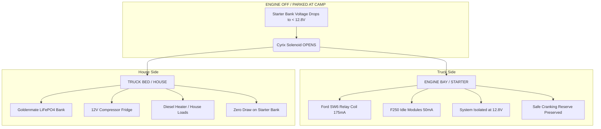

# System Core: Topology, Physics, Fuse Audit, Energy Balance & Technical Debt

**Cross-reference:** This file combines Sections 3, 6, 10, 11, and 12 of the master spec. It is the primary load for **planner** subagent tasks. For wiring details see `spec/02-wiring-schedule.md`; for hardware layout see `spec/04-hardware-layout.md`.

---

## 3. Physical Layout & Wiring Topology

To support easy removal of the SmartCap, the system is divided into three distinct zones connected by quick-disconnects.

```
                                [ ENGINE BAY (SW6 Relay Box) ] 
                                             │
                                    (40A SW6 JCase Fuse)
                                             │
                              [ 8 AWG CCA Frame Run (Under Truck) ]
                                             │
                           [ FRAME T-JUNCTION BOX (POS & NEG) ]
                       ┌──────────────────────┴──────────────────────┐
                  (40A Maxi Fuse)                               (40A Maxi Fuse)
                       ▼                                             ▼
         [ Tail Light Mini Fuse Panel ]                  [ Anderson Connector (8 AWG CCA) ]
           (SmartCap LED Light Strips)                   [ MC4 Connector (18 AWG Ignition) ]
                                                                     │
                                                            [ LOWER SUB-BOARD ]
```

### 🗺️ System Topology Diagram

```mermaid
graph TD
    %% Source & Exterior Locations
    subgraph Roof ["Truck Roof"]
        SolarPanel["200W Solar Panel"]
    end

    subgraph EngineBay ["Engine Bay"]
        StarterBat["Starter Battery<br/><small>(+ / - Lugs)</small>"]
        SW6Relay["Upfitter SW6 Relay<br/><small>(Output Stud)</small>"]
        JCase40["40A JCase Fuse"]
        IgnitionSrc["Upfitter Ignition Bundle"]
    end

    %% Routing Infrastructure
    subgraph FrameRails ["Truck Frame Rails (Under Truck)"]
        PosTJunction["Positive T-Junction Box"]
        NegTJunction["Negative T-Junction Box"]
        PosHighway["8 AWG Pos Highway"]
        NegHighway["8 AWG Dedicated Neg Highway"]
        IgnitionHighway["18 AWG Ignition Line"]
        Maxi40A_1["40A Maxi Fuse (Tail Light Branch)"]
        Maxi40A_2["40A Maxi Fuse (Bed Branch)"]
    end

    subgraph TailLightArea ["Tail Light Cavity"]
        TailLightFuse["Tail Light Mini Fuse Panel"]
        TailLightNeg["Tail Light Neg Bus"]
        BedLights["Custom Bed Lights"]
    end

    %% Central Control & Management
    subgraph UpperBoard ["Upper Sub-Board (Ceiling)"]
        TruckPosBus["Truck-Side Pos Bus Bar"]
        UpperNegBus["Upper Neg Bus Bar"]
        Orion["Victron Orion DC-DC"]
        Cyrix["Cyrix-Li-ct Combiner"]
        MPPT["Victron SmartSolar MPPT"]
        Relay["5-Pin Logic Relay"]
        Wago["Wago Logic Splitter"]
        SolarSwitch["Solar Disable Switch"]
        LogicFuse["2A Logic Fuse"]
    end

    %% Distribution & Storage
    subgraph LowerBoard ["Lower Sub-Board (Bed Wall)"]
        Anderson["Anderson Connector"]
        MC4["MC4 Logic Connector"]
        HouseChgBus["House Charging Bus Bar"]
        HouseLdBus["House Load Bus Bar (Protected)"]
        LowerNegBus["Lower Neg Bus Bar"]
        XT60_Bat1_Chg["XT60 Bat 1 Charge Port"]
        XT60_Bat2_Chg["XT60 Bat 2 Charge Port"]
        XT60_Bat1_Ld["XT60 Bat 1 Load Port"]
        XT60_Bat2_Ld["XT60 Bat 2 Load Port"]
        XT60_Load1["XT60 Load Port 1 (Fridge)"]
        XT60_Load2["XT60 Load Port 2 (Heater)"]
    end

    subgraph Bat1Box ["Battery Box 1"]
        Bat1["Goldenmate Battery 1"]
        MRBF1["50A MRBF Fuse"]
        Shunt1["SmartShunt 1"]
        BP1["BatteryProtect 1"]
        Box1_Chg["XT60 Charge/House Port"]
        Box1_Ld["XT60 Loads Only Port"]
    end

    subgraph Bat2Box ["Battery Box 2"]
        Bat2["Goldenmate Battery 2"]
        MRBF2["50A MRBF Fuse"]
        Shunt2["SmartShunt 2"]
        BP2["BatteryProtect 2"]
        Box2_Chg["XT60 Charge/House Port"]
        Box2_Ld["XT60 Loads Only Port"]
    end

    %% Final Usage Points
    subgraph HouseLoads ["House Loads"]
        Fridge["12V Compressor Fridge"]
        DieselHeater["Diesel Heater"]
    end

    %% Connections with precise terminal labels
    StarterBat --- SW6Relay
    SW6Relay ---|FUSE-40a-jcase:sw6relay-output| JCase40
    JCase40 ---|pos-hwy| PosHighway
    StarterBat ---|neg-hwy| NegHighway
    IgnitionSrc ---|ign-line| IgnitionHighway

    PosHighway --- PosTJunction
    PosTJunction ---|FUSE-40a-maxi:FUSE-5a-atc| TailLightFuse --- BedLights
    PosTJunction ---|FUSE-40a-maxi| Anderson

    NegHighway --- NegTJunction
    NegTJunction --- TailLightNeg --- BedLights
    NegTJunction --- Anderson

    Anderson --- TruckPosBus
    Anderson --- LowerNegBus
    LowerNegBus --- UpperNegBus
    IgnitionHighway --- MC4

    MC4 ---|relay-86| Relay
    TruckPosBus ---|FUSE-2a-atc| LogicFuse
    LogicFuse --- Wago

    Wago ---|relay-30| Relay
    Wago ---|solarswitch-input| SolarSwitch
    SolarSwitch ---|solarswitch-output:mppt-remote-yellow| MPPT

    Relay ---|relay-87a:cyrix-85| Cyrix
    Relay ---|relay-87:orion-remote-h| Orion

    TruckPosBus ---|FUSE-40a-midi:orion-in+| Orion
    TruckPosBus ---|FUSE-30a-midi:cyrix-87| Cyrix
    TruckPosBus ---|FUSE-20a-midi:mppt-bat+| MPPT
    SolarPanel ---|mppt-pv+/-| MPPT

    Orion ---|orion-out+:cyrix-30| Cyrix
    Cyrix ---|cyrix-30:FUSE-30a-midi| HouseChgBus

    %% Negative Returns - Upper Board
    Orion ---|orion-in-/out-| UpperNegBus
    Cyrix ---|cyrix-86| UpperNegBus
    MPPT ---|mppt-bat-| UpperNegBus
    Relay ---|relay-85| UpperNegBus

    %% Lower Board Bus Connections - Charging
    HouseChgBus ---|FUSE-30a-midi| XT60_Bat1_Chg
    HouseChgBus ---|FUSE-30a-midi| XT60_Bat2_Chg

    %% Lower Board Bus Connections - Loads
    HouseLdBus ---|FUSE-30a-midi| XT60_Bat1_Ld
    HouseLdBus ---|FUSE-30a-midi| XT60_Bat2_Ld
    HouseLdBus ---|FUSE-20a-midi| XT60_Load1
    HouseLdBus ---|FUSE-20a-midi| XT60_Load2

    %% Lower Board Negative Connections
    XT60_Bat1_Chg --- LowerNegBus
    XT60_Bat2_Chg --- LowerNegBus
    XT60_Bat1_Ld --- LowerNegBus
    XT60_Bat2_Ld --- LowerNegBus
    XT60_Load1 ---|neg-return| LowerNegBus
    XT60_Load2 ---|neg-return| LowerNegBus

    %% Inter-Board Patch Cables (30-inch XT60)
    XT60_Bat1_Chg ===|xt60-chg-patch| Box1_Chg
    XT60_Bat2_Chg ===|xt60-chg-patch| Box2_Chg
    XT60_Bat1_Ld ===|xt60-ld-patch| Box1_Ld
    XT60_Bat2_Ld ===|xt60-ld-patch| Box2_Ld

    %% Battery Box 1 Internals
    Bat1 ===|MRBF-50A| MRBF1
    MRBF1 ---|direct-chg| Box1_Chg
    MRBF1 ---|BP-IN| BP1
    BP1 ---|BP-OUT| Box1_Ld
    Bat1 ---|neg-cable| Shunt1
    Shunt1 ---|shunt-neg| Box1_Chg
    Shunt1 ---|shunt-neg| Box1_Ld
    Shunt1 ---|BP-GND| BP1

    %% Battery Box 2 Internals
    Bat2 ===|MRBF-50A| MRBF2
    MRBF2 ---|direct-chg| Box2_Chg
    MRBF2 ---|BP-IN| BP2
    BP2 ---|BP-OUT| Box2_Ld
    Bat2 ---|neg-cable| Shunt2
    Shunt2 ---|shunt-neg| Box2_Chg
    Shunt2 ---|shunt-neg| Box2_Ld
    Shunt2 ---|BP-GND| BP2

    %% Load Connections
    XT60_Load1 ---|xt60-patch| Fridge
    XT60_Load2 ---|xt60-patch| DieselHeater
```



> [!NOTE]
> **Implementation Notes:**
> * **Isolated Grounding:** The 8 AWG Dedicated Neg Highway runs directly from the Starter Battery to the Lower Neg Bus Bar, bypassing the vehicle chassis.
> * **Fusing Logic:** House battery XT60 ports are fused at 30A for high-inrush scenarios.
> * **Interlocking Relay:** The 5-Pin relay alternates between the Cyrix (Solar/Stationary) and Orion (Alternator/Driving) based on the Upfitter Ignition signal.

```
                                                          (Wall above tub lip)
                                                                    │
                                                 ┌──────────────────┴──────────────────┐
                                                 ▼                                     ▼
                                       (8 AWG CCA + 18 AWG Run)             (Lower Sub-Board Split Bus Bars)
                                       (Runs up the SmartCap wall)             ├─ Charging Bus Bar (Unprotected)
                                                 │                             │   ├─ 30A Fuse -> XT60 Battery 1 Charge Port
                                                 ▼                             │   └─ 30A Fuse -> XT60 Battery 2 Charge Port
                                        [ UPPER SUB-BOARD ]                    └─ Load Bus Bar (Protected)
                                       (SmartCap Ceiling/Wall)                     ├─ 30A Fuse <- XT60 Battery 1 Load Port
                                                 │                                 ├─ 30A Fuse <- XT60 Battery 2 Load Port
                             ┌───────────────────┼───────────────────┐             ├─ 20A Fuse -> XT60 Load 1 (Fridge)
                             ▼                   ▼                   ▼             └─ 20A Fuse -> XT60 Load 2 (Heater)
                     [ Truck Bus Bar ]   [ 5-Pin Relay ]    [ Upper Negative Bus Bar ]
```

### 🎛️ Sub-Board Details:

#### 1. Lower Sub-Board (Wall above tub lip):
* **Grounding:** The lower common negative bus bar connects directly to the incoming 8 AWG dedicated negative return wire from the Anderson connector. The 8 AWG negative wire leading to the upper board lands on this same terminal (daisy-chained).
* **Bus Bars (Split Positive Configuration):** To utilize the individual battery box over-discharge protection, the lower board's positive distribution is divided into two separate, isolated bus bars:
  1. **House Charging Bus Bar (Unprotected):** Directly connects the upper board charging highway to the battery boxes' direct Charge/House ports.
     * Stud 1: Incoming 8 AWG OFC House Charging Highway (fused at 30A MIDI).
     * Stud 2: XT60 Battery 1 Charge Port (fused at 30A MIDI).
     * Stud 3: XT60 Battery 2 Charge Port (fused at 30A MIDI).
  2. **House Load Bus Bar (Protected):** Parallels the load outputs from the battery boxes' protected Loads Only ports and distributes power to the loads.
     * Stud A: XT60 Battery 1 Load Port (fused at 30A MIDI).
     * Stud B: XT60 Battery 2 Load Port (fused at 30A MIDI).
     * Stud C: XT60 Load Port 1 (Fridge) (fused at 20A MIDI).
     * Stud D: XT60 Load Port 2 (Diesel Heater/Aux) (fused at 20A MIDI).
* **Distribution Ports:** Houses six XT60 external ports (XT60 Battery 1 & 2 Charge, XT60 Battery 1 & 2 Load, and XT60 Loads 1 & 2).
* **Charging Path:** Stud 1 of the House Charging Bus Bar connects to the **8 AWG OFC House Charging Highway** wire running up to the upper sub-board.

#### 2. Upper Sub-Board (SmartCap Ceiling):
* **Truck-Side Positive Bus Bar:** Connects to the incoming always-hot 8 AWG CCA positive line from the Anderson connector.
* **Solar Controller (MPPT) Connections:**
  * Battery (+) runs via a **12 AWG CCA wire** to the truck-side positive bus bar (protected by a **20A MIDI fuse**).
  * Battery (-) runs via a **12 AWG CCA wire** to the upper common negative bus bar.
  * *Logic:* Solar power flows through the truck bus bar and the Anderson/T-junction back to charge the F250's starter batteries first.
* **Combiner (Cyrix) Starter-Side Connection:**
  * Terminal 87 connects to the truck-side positive bus bar via an **8 AWG OFC wire** (protected by a **30A MIDI fuse**).
* **DC-DC Charger (Orion) Input Connection:**
  * Input (+) connects to the truck-side positive bus bar via an **8 AWG CCA wire** (protected by a **40A MIDI fuse**).
  * Input (-) and Output (-) are wired to the upper negative bus bar using **8 AWG CCA**.
* **House Highway Conjunction (Cyrix Terminal 30 / Orion Output+):**
  * The **8 AWG OFC House Charging Highway** wire coming up from the lower board lands directly on **Cyrix Terminal 30**.
  * The Orion Output (+) (8 AWG CCA) lands on this same **Cyrix Terminal 30** lug via a local copper jumper.
  * *Logic:* Power flowing from either the Orion (engine running) or the Cyrix (solar active & starter battery $> 13.4\text{V}$) feeds directly into Cyrix Terminal 30 and travels down the 8 AWG OFC wire to the house positive bus bar.

---

## 6. System Physics & Impedance Verification

### 🔌 Main Charging & Combiner Highway Loop Impedance
The main charging circuit runs from the engine bay along the frame rail, splits at the T-junction, and runs up the SmartCap wall to the upper sub-board:
* **The Wire Run Components:**
  * **Frame Rail Section:** 50-foot round-trip loop of **8 AWG CCA** wire. (Resistance: $\sim0.05\ \Omega$).
  * **SmartCap Vertical Section:** 15-foot round-trip loop of **8 AWG CCA** wire (from T-junction box up to the upper sub-board, representing $\sim1.5\times$ the frame-to-ceiling height). (Resistance: $\sim0.015\ \Omega$).
  * **Connection Overhead:** Anderson connector, fuses, and crimped lug contact resistances. (Resistance: $\sim0.015\ \Omega$).
* **Total Loop Resistance:** **$\sim0.08\ \Omega$** total.
* **Current-Limiting Safety Profile:** Due to this line resistance, Ohm's Law limits the maximum current that can transfer between the starting battery and house batteries during unmanaged balancing loops:
  $$\Delta V = 30\text{A} \times 0.08\ \Omega = 2.4\text{V}$$
* **Nuisance Tripping Prevention:** To draw a fuse-blowing 30A from the starting bank during a Cyrix bridge event, the house bank voltage would have to sit below $11.0\text{V}$ ($13.4\text{V} - 2.4\text{V} = 11.0\text{V}$). Because the Goldenmate internal BMS activates its low-voltage cut-off at $\le 11.0\text{V}$, nuisance fuse-blowing from battery-to-battery balancing inrushes is physically impossible.

### ❄️ House Bank-to-Fridge Load Circuit
The house batteries and lower sub-board are mounted at the **front of the bed** (wall above tub lip), while the fridge sits at the **back of the bed** (near the tailgate).
* **The Wire Run:** A 16-foot round-trip loop of **12 AWG pure copper** wire connects the lower sub-board's XT60 load port to the fridge.
* **Loop Resistance:** 12 AWG copper wire has a resistance of $\sim1.6\ \Omega$ per 1,000 feet.
  $$R_{loop} = 16\text{ ft} \times 0.0016\ \Omega/\text{ft} \approx 0.026\ \Omega$$
* **Voltage Drop Analysis:**
  * **Fridge Startup Surge ($\sim5\text{A}$ transient spike):** $$\Delta V_{surge} = 5\text{A} \times 0.026\ \Omega = 0.13\text{V}\ \text{drop}\ (0.98\%)$$
  * **Continuous Running Draw ($\sim1.5\text{A}$ compressor load):**
    $$\Delta V_{run} = 1.5\text{A} \times 0.026\ \Omega = 0.039\text{V}\ \text{drop}\ (0.3\%)$$
* **Conclusion:** The voltage drop is negligible ($\le1\%$). The 12 AWG copper run is perfectly sized to deliver clean, stable 12V DC power from the front of the bed to the fridge at the tailgate without triggering low-voltage warnings on the fridge compressor controller.

---

## 10. Detailed Fuse Audit & Coordination Analysis

To ensure system reliability, each fuse point has been audited for both wire safety and "nuisance trip" risk under real-world operating conditions.

### 🔌 Primary Highway Fuses
* **40A JCase (Engine Bay):**
    * *Protection:* Correctly sized for 8 AWG CCA (~45A thermal limit in engine bay).
    * *Risk:* **Medium.** Simultaneous load (Orion 20A + Tailgate accessories 15A) reaches 88% capacity. Heat-soaking in extreme weather may cause nuisance trips under heavy accessory load.
* **40A Maxi (Tailgate T-Junction):**
    * *Coordination:* Branch protection for the Anderson and Tailgate panel.
    * *Logic:* If a short occurs at the Anderson connector, the 40A Maxi should blow first, preserving power to the Tailgate lights (selective coordination).

### 🎛️ Upper Sub-Board Logic & Charging
* **30A MIDI (Cyrix Starter-Side):**
    * *Risk:* **Medium/High.** Charging deeply discharged house batteries via the Cyrix bridge can cause inrush spikes $>35\text{A}$. 
    * *Mitigation:* **Soft Start Procedure.** If house batteries are low ($<12.0\text{V}$), toggle SW6 OFF before engine start, wait for Orion initialization, then toggle SW6 ON to charge via the managed 18A Orion path.
* **40A MIDI (Orion Input):**
    * *Logic:* Sized to handle the "Constant Power" draw of the Orion (~28A at low input voltage) with 30% headroom.
* **20A MIDI (MPPT Output):**
    * *Logic:* Sized for 12 AWG CCA. Provides 17% headroom over the 200W panel's theoretical max output (16.6A) to handle "Cloud Edge" solar spikes.

### 🔋 Lower Sub-Board & Battery Isolation
* **30A MIDI (Charging Stud 1 - House Entry):**
    * *Risk:* In series with the Cyrix 30A fuse; shared risk of nuisance blow during high-inrush charging events.
* **30A MIDI (Charging Stud 2 & 3 - XT60 Battery Charge Ports):**
    * *Strict Requirement:* **MUST** balance batteries to 100% SoC before connecting the Charge/House ports. Connecting a full battery in parallel with a discharged battery will result in an immediate fuse blow due to balancing inrush current.
* **30A MIDI (Load Stud A & B - XT60 Battery Load Ports):**
    * *Logic:* Protects the load patch cables from the lower board to the battery boxes. Sized to handle full continuous load draws while offering safety headroom for 12 AWG wire.
* **20A MIDI (Load Stud C & D - XT60 Load Ports):**
    * *Real-World Check:* Sized for diesel heater glow-plug surges (12A) and fridge startup spikes (5A). Extremely low nuisance risk.
* **50A MRBF (Battery Terminal Posts inside Boxes):**
    * *Logic:* Primary internal short-circuit protection for the battery box. In a fault scenario on a patch cable, the lower sub-board's 30A MIDI fuses will blow first (selective coordination), preserving the internal 50A MRBF.

---

## 11. Energy Balance, Parasitic Validation & Ecosystem Physics

This section codifies the mathematical and physical justification for the "Always-ON" Upfitter Switch 6 (SW6) operating philosophy. It proves that the system maintains starting battery health without user intervention under standard driveway and active camping profiles.

### 🔌 Baseline Parasitic Current Modeling
When the vehicle is stationary and SW6 remains toggled ON in the cab, the system enters an autonomous monitoring state. The baseline power debt is calculated across two distinct physical operational modes:

1. **Solenoid Open Mode (Nighttime / Overcast / Settled State):**
   * Ford SW6 Factory Relay Coil Continuous Holding Current: 175mA
   * Victron Cyrix-Li-ct Standby/Sensing Power Consumption: 5mA
   * Ford F250 OEM Factory Module Idle Sleep Draw: 50mA
   * SmartCap Interior Local Switch LED Indicator: 25mA
   * **Total Continuous System Trickle:** 255mA (0.255A)
   * **24-Hour Energy Debt Capacity:** 0.255A × 24h = **6.12 Ah/day**

2. **Solenoid Closed Mode (Active Solar Generation Window):**
   * Combined Standby Currents (Relay + Modules + LED): 250mA
   * Cyrix-Li-ct Magnetic Solenoid Holding Current (Bridged): 220mA
   * **Total Continuous System Trickle:** 470mA (0.470A)

### ☀️ Regional Solar Generation Modeling (OH / KY / WV)
The Renogy 200W Shadowflux N-Type panel features a maximum output current ($I_{mp}$) of ~6.4A. Because it is mounted 100% flat on the SmartCap roof, it is modeled with an angular and thermal de-rating factor of 20–30% to account for cosine losses in the Midwest climate.

* **Driveway Profile (Full Sun - Home, OH):**
  * Average Peak Sun Hours (PSH) Spring–Fall: 3.5 to 5.0 PSH
  * De-rated Solar Current Matrix: 6.4A × 0.80 = 5.12A realized
  * **Daily Energy Harvest Range:** 5.12A × 4.0h ≈ **20.48 Ah/day**
  * **Net Driveway Balance Sheet:** $$20.48\text{ Ah (Inflow)} - 6.12\text{ Ah (Outflow)} = \mathbf{+14.36\text{ Ah Net Surplus/Day}}$$
  * *Validation:* While parked at home between trips, leaving SW6 toggled ON is 100% sustainable. Solar production aggressively dominates the parasitic load, keeping the F250 single starter battery at a continuous float state while automatically pulsing excess energy through the Cyrix to top up the house bank.

* **Canopy Camping Profile (Deep Shade - WV / KY National Forests):**
  * Average realized PSH under dense deciduous leaf cover: 0.75 to 1.25 PSH
  * **Daily Energy Harvest Range:** 6.4A × 1.0h ≈ **6.4 Ah/day**
  * **Net Canopy Balance Sheet:** Solar harvest matches or slightly trails the 24-hour parasitic baseline, creating a mild net-negative energy state on the truck side.

### 🛡️ The Cyrix Voltage Shield & Cranking Protection
To fulfill the "Just Works" constraint without manual battery monitoring, the system utilizes the hard operational thresholds of the Cyrix-Li-ct as an automated low-voltage disconnect.



1. **House Load Isolation:** If the 12V compressor fridge or diesel heater experiences heavy usage while camping under dense canopy, they pull energy directly from the lower sub-board bus bar. As soon as the starter bank drops to **12.8V**, the Cyrix instantly unbridges. The massive house loads are physically quarantined to the Goldenmate LiFePO4 batteries.
2. **Cranking Reserve Worst-Case Scenario:** If the truck is left parked in absolute shade for a maximum 4-day (96-hour) camping trip and SW6 is forgotten:
   * Total energy drawn from the starter battery: $0.255\text{A} \times 96\text{ h} = \mathbf{24.48\text{ Ah}}$
   * The F250's heavy-duty starter battery retains ~75% of its total 100Ah capacity. The 7.3L gas V8 engine retains more than enough cold cranking amps (CCA) to execute a safe start.
3. **Automatic Recovery:** Once the engine starts, the alternator delivers power down the line, the Orion DC-DC wakes up, and the house bank is safely bulk-charged at a continuous 18A rate independent of solar availability.

---

## 12. Accepted Project Technical Debt & Infrastructure Constraints

This section formalizes the deliberate design compromises, legacy infrastructure choices, and accepted technical debt within the micro-grid ecosystem. These constraints are mathematically accounted for and monitored to ensure overall system safety without requiring immediate physical retrofits.

### 🔌 1. Legacy Frame Rail Infrastructure & Vertical Canopy Routing (8 AWG CCA Runs)
The primary high-current transmission path spanning the engine bay to the tailgate T-junction, along with the vertical umbilical runs from the bed floor up to the ceiling panel, consists of **8 AWG Copper-Clad Aluminum (CCA)** wire. 
* **The Trade-Off:** CCA possesses higher linear resistance and lower overall current capacity compared to an identical run of Oxygen-Free Copper (OFC). It is also mechanically stiffer and more susceptible to expansion/contraction tracking under severe environmental thermal cycles.
* **Mitigation & Justification:** This infrastructure is accepted as fixed project debt due to the extensive labor and routing architecture already deployed under the truck chassis and within the canopy walls. Primary protection is strictly enforced by the 40A JCase fuse in the engine compartment. System voltage-drop math confirms that the inherent resistance of this CCA loop serves as a passive physical current limiter during unmanaged engine-bay bridging events. If continuous nuisance fuse-tripping occurs under extreme thermal/load conditions, this run will be scheduled for a wholesale upgrade to 8 AWG OFC.

### 🔋 2. House Battery Connection Standardization (XT60 & 12 AWG Architecture)
The removable Goldenmate 100Ah LiFePO4 battery boxes utilize an enclosure standard built around internal and external **XT60 connection ports paired with 12 AWG OFC primary wiring**. The total physical path length between the lower positive sub-board bus bars and the true internal battery terminal is approximately 34 inches, broken by a modular male/female XT60 patch cable interface.
* **The Trade-Off:** Standardizing on a compact, high-density RC connection format restricts maximum individual envelope current transfers compared to heavy eyelet lugs and 8 AWG terminations. 
* **Fusing Validation (30A MIDI Migration):** To prevent continuous thermal fatigue and eliminate nuisance trips during coupled high-demand surges (e.g., parallel load matching during fridge compressor ignition and diesel heater glow-plug startup), the Battery ports on both the House Charging Bus Bar (Studs 2 & 3) and the House Load Bus Bar (Studs A & B) are populated with **30A MIDI fuses**. 
* **Safety Factor Verification:** 
  1. 12 AWG OFC chassis wiring safely maintains a thermal current capacity rating up to 35A–40A in this run length.
  2. Genuine XT60 connectors are rated for 30A continuous / 60A transient peak.
  3. Under normal 18A Orion charging profiles, the current splits across both balanced parallel paths (~9A per box), rendering a 30A fuse completely structurally safe while preserving rapid-clear overcurrent fault protection if a catastrophic internal battery pack short occurs.
* **Operational Dependency:** The user accepts that the absolute enforcement of the 100% SoC Parallel Balancing Rule (see `spec/05-installation-safety.md`) is the primary line of defense against instantaneous double-fuse failures at these ports during hot-swapping maneuvers.

### ⚡ 3. Non-Isolated DC-DC Ground Shift & Common-Mode Noise (Compound CCA Path)
The Victron Orion-Tr Smart is a non-isolated charger featuring a shared internal negative current plate. Because the high-current charging return path (~28A alternator draw) shares the single 8 AWG vertical Inter-Board Negative wire spanning the lower and upper bus bars, an intentional common-mode ground shift ($\sim0.15\text{V}$ to $0.25\text{V}$) is accepted on the upper board during active driving cycles due to the compound use of 8 AWG CCA wire for the inter-board negative highway and the main return line.
* **The Trade-Off:** The upper negative bus bar floats significantly above true battery ground while the vehicle alternator is actively bulk-charging the house bank. This skews the local ground reference for any monitoring electronics sharing that ceiling panel.
* **Component Safety & Isolation Verification:** Because the entire micro-grid utilizes an isolated negative return highway directly back to the starter battery, this transient ground shift is entirely contained within the canopy ecosystem. It is physically impossible for common-mode noise to migrate back into the Ford F250's factory chassis ground networks or trigger OEM module communication faults.
* **Cyrix Chattering Mitigation:** While a ground shift skews voltage-sensing accuracy, the 5-Pin SPDT logic relay serves as a physical interlock. Because the relay breaks the Cyrix control circuit (Pin 85) whenever the vehicle ignition is hot, the Cyrix is completely mechanically immobilized during high-current Orion cycles, rendering chattering or premature contact degradation physically impossible.
* **Victron Smart Software Calibration:** To account for this shift when dialing in the system via Bluetooth, the following software compensations are applied within the VictronConnect app parameters:
  1. *Victron Orion Input Voltage Lock-out:* Set to 12.6V or 12.7V to guarantee clean engine shutdown detection despite the elevated ground reference.
  2. *Victron SmartSolar MPPT:* Bulk and Float charge targets are shifted upward by $+0.15\text{V}$ to ensure true terminal voltages are achieved at the lower panel during simultaneous solar/alternator charging windows.
