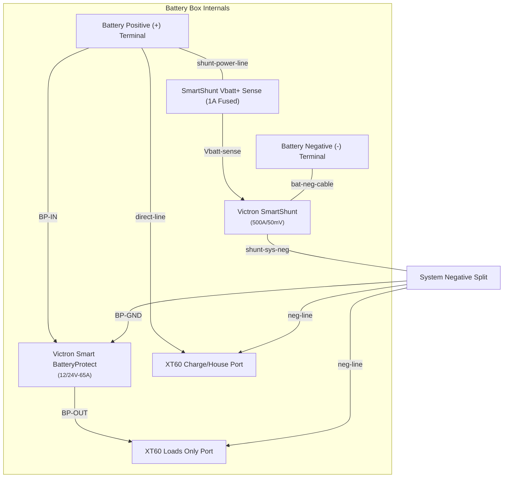

# Hardware Inventory & Electrical Distribution

**Cross-reference:** This file combines Sections 2, 5, and 5A of the master spec. For bus bar stud assignments in context of the wiring schedule, see `spec/02-wiring-schedule.md`. For fuse values and coordination, see `spec/01-system-core.md` (Section 10).

---

## 2. Core Hardware Inventory & Specifications

### Power Sources & Buffers:
* **House Bank (Removable):** 2x Goldenmate 100Ah Lithium Iron Phosphate (LiFePO4) batteries (each enclosed in a custom battery box sitting on the truck bed floor).
  * *Internal Protection & Monitoring:* 
    * Integrated battery BMS with Low-Voltage Disconnect (LVD) threshold $\le 11.0\text{V}$.
    * 1x Victron SmartShunt (500A/50mV) for individual state-of-charge, voltage, and current monitoring.
    * 1x Victron Smart BatteryProtect (12/24V-65A) protecting the load-only discharge path.
    * 1x 50A MRBF positive terminal fuse for primary internal box protection.
  * *External Connections:* Each battery box features two external XT60 ports:
    1. **Charge/House Port:** Direct connection to battery terminals (post-MRBF, post-SmartShunt) for charging or general house battery use.
    2. **Loads Only Port:** Connected via the BatteryProtect for load discharge protection.
  * *Local Fusing & Cabling:* Each battery box connects to the lower sub-board via two separate **12 AWG 30-inch XT60-to-XT60 patch cables** (one for charge/house path, one for protected load path).
  * *Panel Fusing:* Each XT60 port on the lower board is individually fused: charging ports are fused at **30A** on the House Charging Bus Bar; load ports are fused at **30A** on the House Load Bus Bar.
* **Starter Bank:** 2024 Ford F250 OEM single lead-acid starting battery.
* **Solar Array:** 1x Renogy 200W Shadowflux High-Efficiency N-Type Panel.
  * *Max Voltage ($V_{mp}$):* $31.3\text{V}$
  * *Open-Circuit Max Voltage ($V_{oc}$):* $36.5\text{V}$
  * *Max Current ($I_{sc}$):* $\sim7\text{A}$

### Management & Control Electronics:
* **DC-DC Charger:** Victron Orion-Tr Smart 12/12-18A (18A continuous output).
* **Battery Combiner:** Cyrix-Li-ct Intelligent Voltage-Sensing Combiner (bridges at $\ge 13.4\text{V}$, opens at $< 12.8\text{V}$).
* **Solar Charge Controller:** Victron SmartSolar MPPT (Mounted on the upper sub-board, wired to the **truck-side** positive bus bar).
* **Logic Controller:** 5-Pin SPDT Automotive Relay (12V, 30/40A rated).

### Thermal Mitigation Infrastructure:
* **Orion Heat Spreader:** 1x 1/4" (or 3/8") Solid Aluminum Plate. Cut to extended dimensions to act as a conductive lateral radiator backing behind the horizontally mounted Orion DC-DC charger.

---

## 5. Main House Panel Power Distribution & Fusing

The lower sub-board house positive bus bar distributes power between the battery ports and the house loads. Both the direct (Charge/House) and the BatteryProtect-protected (Loads Only) paths from each battery are paralleled onto a single bus bar via individual 30A fuses, with each load port on its own fuse.

```
                          [ HOUSE POSITIVE BUS BAR ]
      _______________________/_______|___________|___________
     |               |               |               |               |
 [ STUD 1 ]      [ STUD 2 ]      [ STUD 3 ]      [ STUD 4 ]      [ STUD 5 ]
   (Input)         (30A)           (30A)           (30A)           (30A)
     |               |               |               |               |
  Incoming       XT60 Bat 1     XT60 Bat 1     XT60 Bat 2     XT60 Bat 2
Charging Hwy     Chg Port       Ld Port        Chg Port       Ld Port

                                  [ LOADS BUS CONTINUATION ]
                                _________|___________
                               |                       |
                           [ STUD 6 ]              [ STUD 7 ]
                             (20A)                   (20A)
                               |                       |
                           XT60 Load 1             XT60 Load 2
                           (Fridge)                (Heater/Aux)
```

* **Stud 1: House Charging Highway (MIDI / 30A - at this stud)**
  * *Wiring:* 8 AWG OFC positive wire running down from Cyrix Terminal 30 on the upper board. The 30A MIDI fuse protects this run from house-side short circuits.
* **Stud 2: XT60 Battery 1 Charge/House Port (30A Fuse)**
  * *Wiring:* 12 AWG pure copper pigtail to XT60 port. Connected to the Battery Box 1 "Charge/House" XT60 port via a 30" 12 AWG patch cable.
* **Stud 3: XT60 Battery 1 Loads Only Port (30A Fuse)**
  * *Wiring:* 12 AWG pure copper pigtail to XT60 port. Connected to the Battery Box 1 "Loads Only" XT60 port via a 30" 12 AWG patch cable (protected at the battery box by the internal BatteryProtect).
* **Stud 4: XT60 Battery 2 Charge/House Port (30A Fuse)**
  * *Wiring:* 12 AWG pure copper pigtail to XT60 port. Connected to the Battery Box 2 "Charge/House" XT60 port via a 30" 12 AWG patch cable.
* **Stud 5: XT60 Battery 2 Loads Only Port (30A Fuse)**
  * *Wiring:* 12 AWG pure copper pigtail to XT60 port. Connected to the Battery Box 2 "Loads Only" XT60 port via a 30" 12 AWG patch cable (protected at the battery box by the internal BatteryProtect).
* **Stud 6: XT60 Load Port 1 (20A Fuse)**
  * *Wiring:* 12 AWG pure copper pigtail to XT60 load port. Connected to the 12V compressor fridge run.
* **Stud 7: XT60 Load Port 2 (20A Fuse)**
  * *Wiring:* 12 AWG pure copper pigtail to XT60 load port. Connected to the diesel heater run (or secondary aux load).

---

## 5A. Battery Box Internals & Individual Battery Monitoring

Each of the two removable house batteries is housed inside a custom battery box. Each box functions as a self-contained power module with dedicated over-discharge protection, current/state-of-charge monitoring, and dual-port output.

### 🗺️ Battery Box Internal Schematic


### 📋 Component Details & Wiring Specifications

1. **Victron SmartShunt (500A/50mV):**
   * **Purpose:** Measures all current entering and leaving the individual battery. Enables precise tracking of State of Charge (SoC), voltage, and current via Bluetooth.
   * **Negative Wiring:** The battery's negative terminal connects directly to the SmartShunt **"TO BATTERY"** terminal using a short, heavy-gauge copper cable (10 AWG or 8 AWG). The **"TO SYSTEM"** terminal connects to the negative pins of both the Charge/House XT60 port and the Loads Only XT60 port.
   * **Power / Voltage Sense:** A thin red wire with an integrated **1A inline fuse** connects from the battery positive terminal to the SmartShunt's **Vbatt+** terminal.
2. **Victron Smart BatteryProtect (12/24V-65A):**
   * **Purpose:** Acts as a smart low-voltage disconnect (LVD) for load circuits, preventing over-discharge and protecting LiFePO4 cell health.
   * **Positive Wiring:** 
     * **IN Terminal:** Connected directly to the battery positive terminal.
     * **OUT Terminal:** Connected to the positive pin of the external **Loads Only XT60 Port**.
   * **Ground Connection (GND Pin):** Connected to the SmartShunt "TO SYSTEM" terminal (system negative) using a thin 18 AWG black wire.
   * **Programming:** Configured via Bluetooth in "LiFePO4" mode with a cut-off threshold of **$11.5\text{V}$ or $12.0\text{V}$** (re-engage at $12.8\text{V}$). This cutoff is deliberately higher than the Goldenmate BMS low-voltage cut-off ($11.0\text{V}$) to prevent the battery's internal BMS from latching off and requiring a wake-up voltage.
3. **Dual External Ports:**
   * **XT60 Charge/House Port:** Wired directly to the battery positive terminal and system negative (post-SmartShunt). Used for charging and general house bus connection (unprotected by BatteryProtect).
   * **XT60 Loads Only Port:** Wired to the BatteryProtect OUT terminal (+) and system negative (post-SmartShunt) (-). Used to supply power to the house load circuits.
