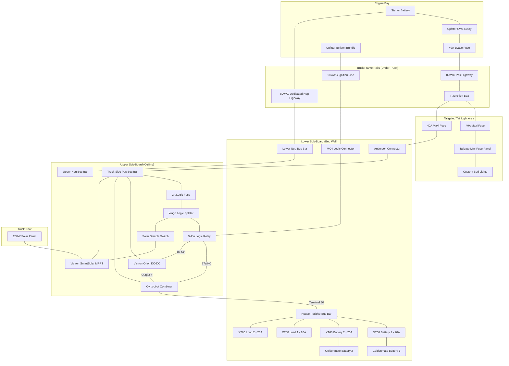

# Solar Truck Micro-Grid: System Topology Diagram

This diagram visualizes the physical and logical layout of the electrical system, organized by physical location in the 2024 Ford F250 and SmartCap.

## Implementation Notes:
* **Isolated Grounding:** The 8 AWG Dedicated Neg Highway runs directly from the Starter Battery to the Lower Neg Bus Bar, bypassing the vehicle chassis.
* **Fusing Logic:** House battery XT60 ports are fused at 20A (Conservative) with 30A spares available for high-inrush scenarios.
* **Interlocking Relay:** The 5-Pin relay alternates between the Cyrix (Solar/Stationary) and Orion (Alternator/Driving) based on the Upfitter Ignition signal.
